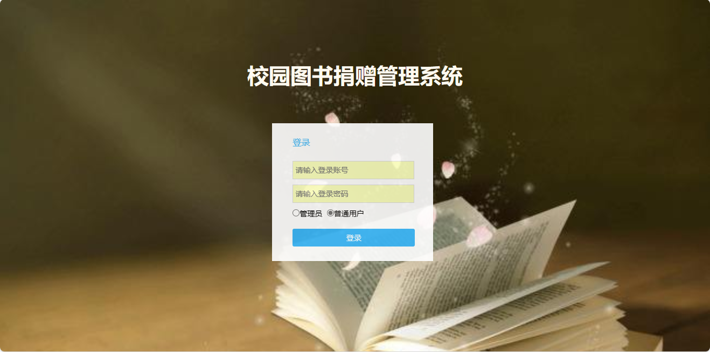
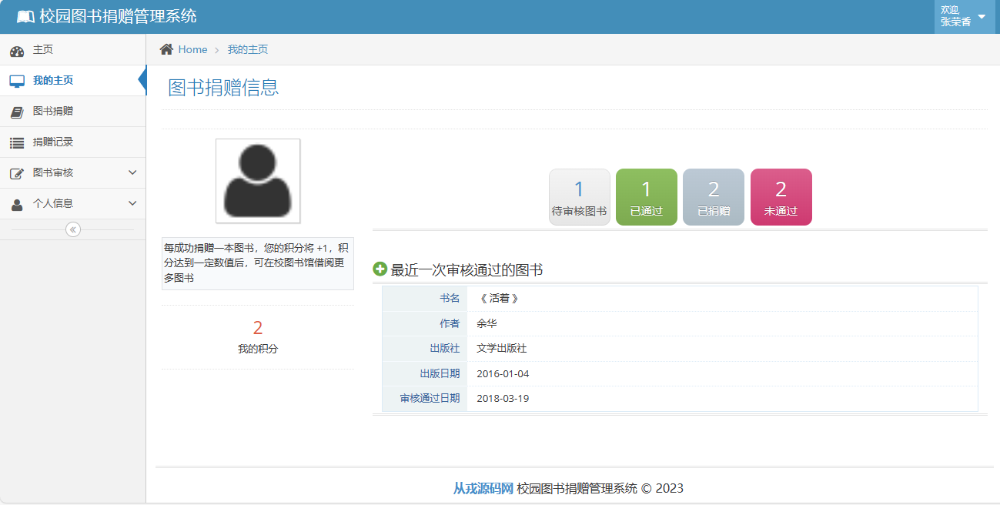
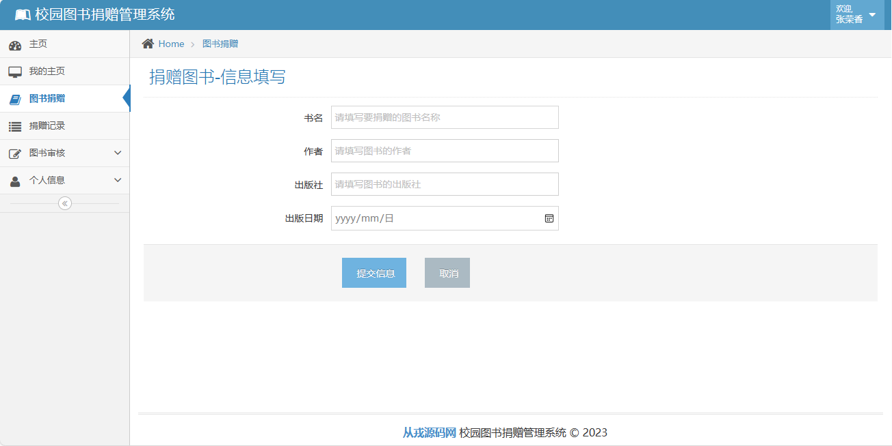
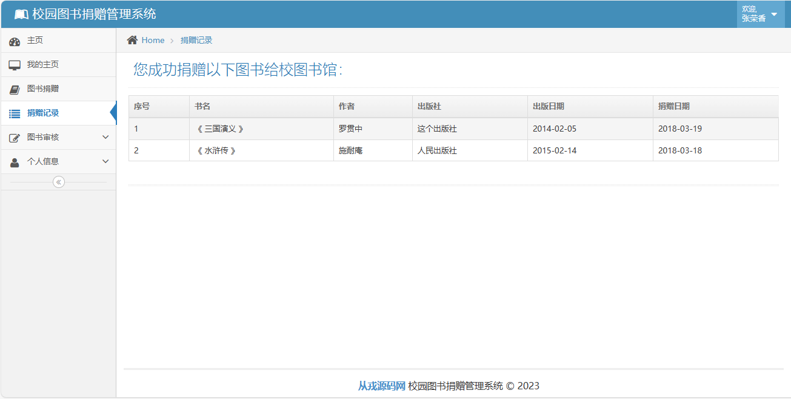
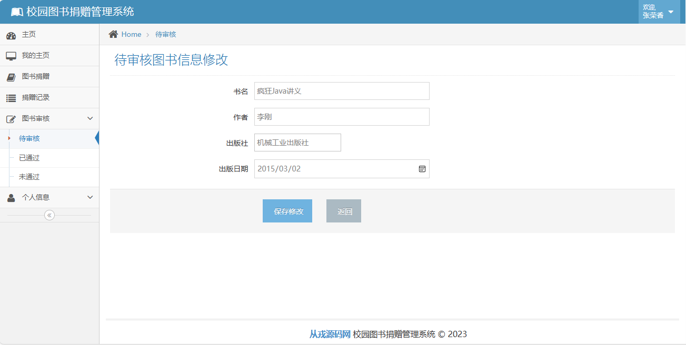
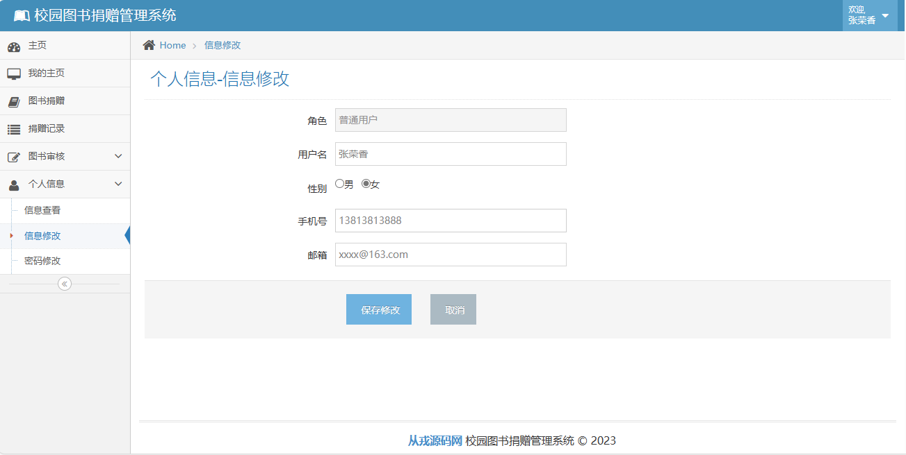
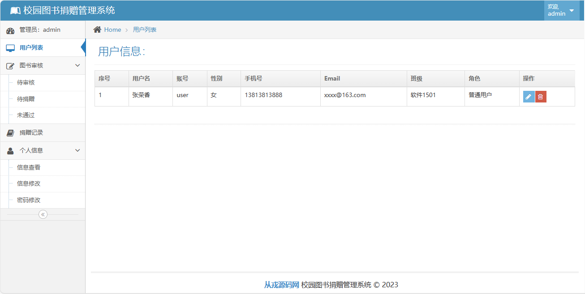

<h1 align="center">35.基于ssm的校园图书捐赠管理系统</h1>

 获取sql文件 QQ: 386869957 QQ群: 377586148 

 [推荐站点: 从戎源码网](https://armycodes.com/) 

## 简介

> 本代码来源于网络,仅供学习参考使用!
> 
> 登录地址：http://localhost:8080/login.jsp
> 
> 用户：user 123456
> 
> 管理员：admin 123456
>

## 环境

- <b>IntelliJ IDEA</b>

- <b>Mysql 5.7</b>

- <b>Tomcat 7.0.73</b>

- <b>JDK 1.8</b>

## 项目介绍
基于ssm的校园图书捐赠管理系统：SSM（Spring+SpringMVC+MyBatis）框架写的一个图书捐赠管理系统，包括用户端和管理员端。前端模板框架使用的是ace-admin，数据库使用MySQL。该系统虽然分了两个用户角色（用户端/管理员端），但是业务逻辑非常简单，还是比较适合学习SSM的同学们。

## 功能介绍

### 管理员端功能
- 查看用户列表
- 查看、修改、删除待审核的图书
- 查看待用户捐赠的图书
- 查看未通过审核的图书
- 查看捐赠记录
- 信息查看、信息修改、密码修改
### 用户端功能
- 用户登录
- 查看图书捐赠信息
- 捐赠图书
- 查看图书捐赠记录
- 查看待审核的图书
- 查看已通过审核的图书
- 查看未通过审核的图书
- 信息查看、信息修改、密码修改

## 运行截图

